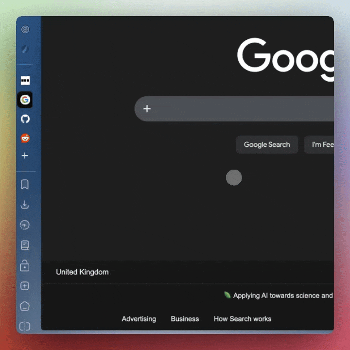

<!--suppress HtmlDeprecatedAttribute -->

<picture>
  <source media="(prefers-color-scheme: dark)" srcset="assets/phli-dark-mode.svg">
  <source media="(prefers-color-scheme: light)" srcset="assets/phli-light-mode.svg">
  
</picture>

# Phli

Vivaldi browser mod extending [(Phi)](https://github.com/KaKi87/phi-for-vivaldi) with left sidebar hover
functionality and a few other Arc-inspired tweaks.

## Purpose

Coming from Arc, I found Vivaldi great overall, but missed the small things, such as the slick hoverable sidebar
and the overall aesthetic of the sidebar. Phi had all the styling I wanted, but the hover
wasn't there. Phli adds it, along with a few other small tweaks inspired by Arc, with more planned.

> **Note:** Vivaldi is in the process of natively adding hover sidebar support — it may be worth trying
> a beta release to see if it fits your needs before using this mod.

## Installation

See [this forum post](https://forum.vivaldi.net/topic/10549/modding-vivaldi) for how to install and
manage Vivaldi mods, including useful community resources in the replies.

## Features

- Arc-like sidebar hover open/close with a lock toggle button
- *(More Arc-inspired tweaks planned, with the next being the `cmd+t` popup interface)*

## License

MIT — see [LICENSE](LICENSE) for details.

---

<i>Based on <a style="text-decoration: none; color: #7ba7bc" href="https://github.com/KaKi87/phi-for-vivaldi">Phi</a> by KaKi87, licensed under MIT.</i>